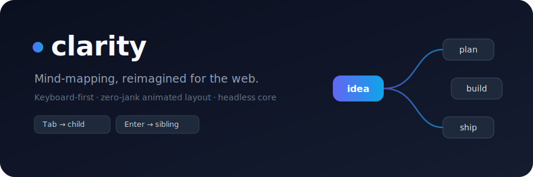

<p align="center">
  
</p>

<h1 align="center">clarity</h1>

<p align="center">
  <strong>A better-UX, open-source mind-mapping library for the web.</strong><br/>
  A headless TypeScript core + a batteries-included React component — the mind map you'd actually enjoy using, embeddable in your own app.
</p>

<p align="center">
  <a href="https://www.npmjs.com/package/clarity-mind"></a>
  <a href="https://www.npmjs.com/package/@clarity-mind/react"></a>
  <a href="https://github.com/udielenberg/clarity/actions/workflows/ci.yml"></a>
  <a href="./LICENSE"></a>
</p>

---

## Why clarity?

Great mind-mapping apps (SimpleMind, XMind, MindNode) are polished but **proprietary and non-embeddable**. The open-source options are powerful but clunky. clarity aims to be the one that feels great _and_ drops straight into your product.

The whole library is judged on **UX**:

- ⌨️ **Keyboard-first** — `Tab` for a child, `Enter` for a sibling, arrows to move, just start typing to edit. Never touch the mouse.
- 🪄 **Zero-jank layout** — nodes _glide_ into place when the map changes. No teleporting, no reflow flash.
- ✏️ **Inline editing** — edit a topic in place, not in a side panel.
- 🌳 **Effortless restructuring** — drag a branch onto a new parent; rock-solid undo/redo.
- 🧩 **Headless core** — the model, layout, and I/O are DOM-free and framework-agnostic. Bring your own renderer, or use the React one.

## Packages

| Package                                   | Version                                                                                                                                  | What it is                                                                                                                 |
| ----------------------------------------- | ---------------------------------------------------------------------------------------------------------------------------------------- | -------------------------------------------------------------------------------------------------------------------------- |
| [`clarity-mind`](./packages/core)         | [](https://www.npmjs.com/package/clarity-mind)                   | The **headless engine** — immutable tree model, tidy-tree layout, undo/redo, Markdown + JSON I/O. **No DOM.**              |
| [`@clarity-mind/react`](./packages/react) | [](https://www.npmjs.com/package/@clarity-mind/react) | The **React component** — DOM nodes + SVG connectors, keyboard-first editing, drag-to-reparent, pan/zoom, animated layout. |

## Quick start (React)

```bash
npm install clarity-mind @clarity-mind/react
```

```tsx
import { createStore } from "clarity-mind";
import { MindMap } from "@clarity-mind/react";

const store = createStore("My big idea");

export default function App() {
  return <MindMap store={store} style={{ height: "100vh" }} />;
}
```

That's a fully interactive, editable mind map. The `store` is yours to read, mutate, persist, or subscribe to.

### Keyboard & mouse

| Input                           | Action                            |
| ------------------------------- | --------------------------------- |
| `Tab`                           | Add a child to the selected node  |
| `Enter`                         | Add a sibling                     |
| `F2` / start typing             | Edit the node                     |
| `Delete` / `Backspace`          | Remove the node (and its subtree) |
| `↑ ↓ ← →`                       | Move the selection                |
| `Space`                         | Collapse / expand                 |
| `⌘/Ctrl + Z` · `⇧⌘Z / Ctrl + Y` | Undo · redo                       |

Mouse: **click** selects · **double-click** edits · **hover** reveals a `+` (add child) and a collapse toggle · **right-click** opens the full menu · **drag a node onto another** to re-parent · **drag the background** to pan · **wheel** to zoom.

## Headless core (no React)

The core knows nothing about the DOM — it gives you the model, a deterministic layout, and I/O. Pair it with any renderer (canvas, SVG, your own framework).

```ts
import { createStore, layout, toMarkdown, fromMarkdown } from "clarity-mind";

const store = createStore("Roadmap");
const q1 = store.addChild(store.rootId, "Q1");
store.addChild(q1, "Ship v1");

// Positioned boxes + edges for your renderer — you supply node sizes.
const { boxes, edges, bounds } = layout(store.map.root, {
  measure: (node) => ({ width: node.text.length * 8 + 24, height: 32 }),
});

// Round-trips through plain Markdown outlines.
const md = toMarkdown(store.map.root); // "- Roadmap\n  - Q1\n    - Ship v1"
const tree = fromMarkdown(md);

store.undo();
store.redo();
```

Every model operation is **pure** (returns a new tree, never mutates), which is what makes undo/redo and predictable rendering trivial.

## Live demo

A Vite playground doubles as the live demo and a scratchpad:

```bash
npm install
npm run dev        # opens the demo
```

## Development

This is an npm-workspaces monorepo (TypeScript strict, Vitest, ESLint, Prettier).

```bash
npm install
npm test           # Vitest
npm run typecheck
npm run lint
npm run build      # builds core → react → demo
```

## Contributing

Issues and PRs are welcome. Please run `npm test`, `npm run typecheck`, and `npm run lint` before opening a PR — CI runs all three.

## License

[MIT](./LICENSE) © udielenberg
